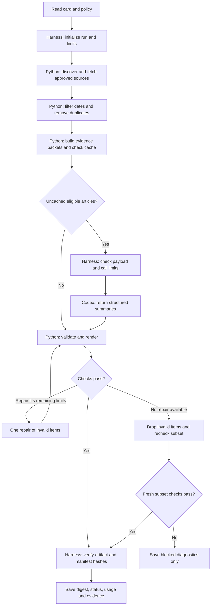

# Studio 1 research agent — engineering plan

Owner: **jamieYe0317**, individual submission

Status: **Implemented locally; see README.md and outputs for execution evidence**

Prepared: 2026-09-18

Implementation note (2026-09-18): the working backend uses the existing Codex login and an explicit low-reasoning override for summarization. It has been exercised on live sources. Application token counts are labeled UTF-8-size estimates, with actual provider usage recorded separately. A shared 6,000-token estimated evidence pool now reallocates unused article slots while keeping the original per-request and cumulative limits. The source adapter refetches live content before cache reuse; conditional HTTP/304 optimization is deferred. The sections below retain the design and its intended constraints; README.md documents the executable interface.

Local hosting extension (2026-09-18, requested after the backend build): `code/server.py` and `web/` add a loopback browser interface over the same harness. It displays saved runs and starts one live or synthetic job at a time. Fresh verification failures withhold the digest. Browser requests require the expected local host, matching origin, and session token for job creation. The original CLI design below remains available; public hosting and scheduling are outside this extension.

## 1. Outcome and scope

Build a repeatable local command that produces a short AI-news digest, plus evidence showing what it read, which checks passed, how it handled failure, and how many model tokens it used.

The first version covers OpenAI News, Anthropic News, and Anthropic Engineering. It selects up to five recent, distinct articles and produces a title, publication date, source link, 40–70-word summary, and one short explanation of relevance for each. Relevance is explicitly labeled as interpretation; announcements are attributed to their publisher rather than presented as independent verification of vendor claims.

“Past seven days” will mean seven calendar dates, including the run date, in `America/New_York`. For example, a run dated September 18 covers September 12–18 inclusive. Store the exact UTC run timestamp as well. A dated publication later than that timestamp is ineligible; date-only publications retain their date-only precision. This definition is a configurable design choice, not an inferred exact publication time.

The deliverable is a command-line workflow with Markdown and JSON artifacts. The MVP uses one summarization model and ordinary Python for the surrounding work. Scheduling, a web interface, vector databases, model-generated research plans, and multiple cooperating research agents are outside this first version.

## 2. Workspace and course requirements

Private repository: [jamieYe0317/agentic-engineering-private](https://github.com/jamieYe0317/agentic-engineering-private).

All project files belong under:

```text
studio/studio-01/submission/jamieYe0317/
```

Planning branch: `studio-01-research-plan`. Keep course-owned instructions, workflows, root README, bootstrap script, and AGENTS.md unchanged. The user's explicit private-copy instruction governs our working location; the older Studio 1 public-PR instructions will not cause an automatic public submission.

The [Studio 1 exercise](https://github.com/NickGuAI/agentic-engineering-course/blob/main/studio/studio-01/instruction/Studio01.md) requires a delegation card, an observable run, one changed condition, an evidence-led correction, and a comparison. The personal `explanation-jamieYe0317.md` must be written by Jamie. Do not create AI-generated prose or a completed placeholder for that file. Engineering documentation and machine-generated evidence are separate artifacts.

| Requirement | Planned evidence |
|---|---|
| Bounded delegation | Completed four-field delegation card and versioned policy |
| First observable run | Live digest, source manifest, sanitized events, verification report |
| Changed condition | A reproducible source-fetch failure with its original outcome preserved |
| Correction and comparison | Corrected rerun and machine-generated before/after measurements |
| Token optimization | Fixed-input comparison of full text versus selected evidence; separate cache replay |
| Personal explanation | Jamie's own later write-up, outside AI authoring |

## 3. Runtime decision

**Draft default: use the existing local Codex login through a Python adapter.** The user can select the API alternative before implementation; this plan does not assume an API key or paid API account. Preserve the user's configured model choice, then pin and record the effective model and reasoning settings for reproducible runs. Do not silently upgrade models or increase reasoning effort.

Codex supports non-interactive JSON events, a final-output JSON schema, and saved authentication. Its usage events can support a normalized ledger. These capabilities support the adapter design. [Official non-interactive documentation](https://learn.chatgpt.com/docs/non-interactive-mode)

The local CLI help was inspected on 2026-09-18: version `0.154.0-alpha.6.2` exposes `--json`, `--output-schema`, `--ephemeral`, `--ignore-user-config`, and `--sandbox read-only`. That help does not expose an explicit total-token cap for an entire execution. Consequently, CLI mode will enforce application-payload, invocation, and elapsed-time limits while reporting actual provider usage afterward. It will **not claim a hard end-to-end token ceiling**.

If an exact generated-token ceiling is required, replace the adapter with a tool-free Responses API call using a counted request and `max_output_tokens`. That limit includes non-visible generated tokens; visible answer length alone is not the full usage. This is an alternative backend, not a second implementation required for the MVP. [Official token-counting documentation](https://developers.openai.com/api/docs/guides/token-counting)

## 4. Architecture

The harness is the supervisor around the model: it decides what work is allowed, applies resource limits, records events, and checks whether the result is ready. The model writes article summaries from supplied evidence; it cannot change the run's policy.



The repair edge is guarded by an irreversible per-run counter; the diagram does not authorize an open-ended loop. Discovery, ranking, rendering, and ordinary checks make zero model calls.

| Component | Responsibility and contract |
|---|---|
| `run.py` | Parse CLI/configuration, require `--team jamieYe0317`, inject clock, invoke controller |
| `harness.py` | Validate actions, enforce policy, record events, manage state and terminal outcome |
| `sources.py` | Approved-source discovery, bounded HTTP, extraction, dates and canonical URLs |
| `evidence.py` | Deduplicate, select paragraphs, assign evidence IDs, cache validated summaries |
| `model.py` | Execute one configured backend, parse structured results, normalize usage |
| `verify.py` | Check schema, provenance, policy, coverage and freshness; render deterministically |
| `tests/` | Synthetic source fixtures, fake model adapter and meaningful failure tests |

Target the existing Python 3.9 runtime initially. Prefer standard-library JSON, dataclasses, hashing, HTTP, HTML parsing, subprocess, and unittest facilities. Add a local tokenizer only with a verified compatible version; pin any added dependencies during implementation. No agent framework is required.

## 5. Data collection and evidence contracts

### Source policy

Start discovery only at the three configured publisher sections:

- [OpenAI News](https://openai.com/news/)
- [Anthropic News](https://www.anthropic.com/news)
- [Anthropic Engineering](https://www.anthropic.com/engineering)

During the source-adapter spike, inspect actual feed links, HTML, article URLs and publication metadata. Prefer a publisher-provided feed when available; use section HTML as a bounded fallback. Do not assume feed endpoints or HTML selectors before checking them. Some OpenAI news links may lead to a different path on the same publisher host; explicitly enumerate acceptable article paths from observed links rather than assuming every article is under `/news/`.

The HTTP adapter accepts HTTPS URLs on exact approved hosts and checked article paths. It validates each redirect before following it, rejects credentials in URLs and private/local destinations, limits response size, and never follows arbitrary external links found in an article. Record the original URL, final URL, retrieval time, HTTP outcome, publication metadata, and normalized content hash.

Dates come from publisher metadata or visible publication text with recorded provenance. Missing or conflicting dates cause exclusion with a reason. Do not use retrieval time as publication time or ask the model to guess. Sorting is deterministic: newest eligible publication first, then canonical URL for ties. Deduplicate canonical URLs and identical normalized content before summarization; do not merge distinct articles solely because their titles resemble one another.

### Evidence packets

For each selected article, retain title, publication metadata, canonical URL, article ID, and numbered source paragraphs. Select complete paragraphs containing the announcement, practical details, availability, and important limitations. Preserve paragraph offsets and content hashes in local evidence. If the selection budget cannot retain the needed caveats, mark the article insufficient instead of cutting text mid-sentence and pretending it is complete.

The model receives packets containing only the selected evidence and a short stable instruction. Page content is clearly identified as source data. Instructions embedded in a page cannot change approved hosts, tool availability, output locations, credentials, or budgets.

The model returns only article IDs, summaries, relevance statements, evidence IDs for factual claims, and an `insufficient_evidence` indication where necessary. Python attaches source titles, dates and URLs from the manifest, preventing the model from inventing those fields. Unsupported or unknown IDs are rejected. A source-backed relevance fact needs evidence; broader implications must be labeled as interpretation.

### Core records

| Record | Required contents |
|---|---|
| Run manifest | Run ID, mode, clock/window, team, policy hash, implementation identity, runtime/model/settings |
| Article record | Source ID, canonical URL, date/precision/provenance, fetch outcome, content and packet hashes |
| Summary record | Article ID, summary, relevance, factual-claim evidence IDs, validation state |
| Verification record | Check/version, result, failures, digest hash, input-manifest hash |
| Usage record | Invocation ID, application payload size/count method, provider usage fields, missing-data flags |

The implementation identity includes the Git commit plus hashes of relevant uncommitted code/configuration, so evidence remains identifiable before a commit is made.

## 6. Built-in harness

Adapt the useful control principles from the [course harness](https://github.com/NickGuAI/agentic-engineering-course/blob/main/studio/studio-01/instruction/code/harness_demo.py): strict actions, bounded steps, idempotent effects, event recording, and a fresh passing check before completion. The original fixture remains unchanged. The research harness is application control and evidence checking, not a claim of adversarial operating-system isolation.

### Action and state rules

An action has `operation_id`, `name`, and schema-validated `arguments`. Approved operations are `discover`, `fetch`, `select`, `summarize`, `verify`, and `finish`; rendering and persistence are harness-owned effects. Reject unknown operations, extra argument keys, unknown evidence IDs, and caller-supplied arbitrary file paths.

Run states are `created → collecting → evidence_ready → summarizing → verifying → finished`. Cache-only and empty paths may skip summarization. A single repair returns to summarizing when budget permits. A terminal run accepts no new actions.

Repeated successful operations with the same ID and argument hash replay their recorded result without refetching or recalling the model. Reusing an ID with different arguments is rejected. A deliberate retry uses a new attempt ID linked to the original operation and consumes the same global budget. An uncertain model timeout is not automatically replayed as if it were free.

Immediately before a model invocation, check invocation count, remaining time, allowed article IDs, packet size, and cumulative application-input allowance. Reserve the invocation and its application input before dispatch; a failure does not restore the invocation counter. Actual provider usage is recorded separately when available.

### Initial policy defaults

These are design defaults to test and calibrate, not measured performance claims.

| Limit | Default | Enforcement |
|---|---:|---|
| Source indexes | 3 | Exact configured sections |
| Candidate metadata records | 30 total | Deterministic cutoff, reported in coverage |
| Article fetches | 10 | Before HTTP dispatch |
| Total HTTP attempts | 16 | Includes indexes, article attempts, redirects and retries |
| Concurrent HTTP requests | 2 | Shared counters reserved before dispatch |
| HTTP timeout | 10 seconds | Per request, also bounded by run deadline |
| HTTP response size | 2 MiB | Streaming byte ceiling; oversized content is rejected |
| HTTP retry policy | At most 1 per failed URL, 3 retries total | Only transient failures; all consume attempt budget |
| Published items | 0–5 | Verified at render time |
| Harness actions | 50 | Includes failed actions and retries |
| Model subprocess invocations | 2 maximum | One initial batch and at most one repair |
| Model process timeout | 120 seconds | Kill/reap process group on timeout |
| Total elapsed run time | 300 seconds | Each operation uses the smaller remaining deadline |
| Writes | This submission directory only | Fixed artifact names; resolve paths and reject escaping symlinks |

The HTTP-attempt cap is the outer constraint: redirects and retries may reduce how many articles can be fetched. Intentional selection of five items is normal; an incomplete source scan or budget cutoff is explicitly reported as limited coverage.

### Model adapter restrictions

Run an ephemeral, fresh Codex execution with structured output and a read-only sandbox. Ignore ordinary user configuration for the summarizer invocation, then explicitly supply the selected model/settings. Disable shell tools and web search, and ensure that project configuration, inherited MCP connections, plugins, and hooks do not reintroduce tools. The documented controls include `features.shell_tool` and `web_search`; verify their effective behavior against the installed version in the adapter spike. [Official configuration reference](https://learn.chatgpt.com/docs/config-file/config-reference)

Use an argument array with `shell=False`, a narrow subprocess environment, and an isolated scratch working directory under ignored local work storage. Leave normal credential handling with the CLI; do not read or copy authentication files into prompts or artifacts. Unexpected command, network-tool, file-change, or MCP events invalidate the adapter run. Event detection is a diagnostic backstop, not a substitute for disabling capabilities before execution.

If effective configuration cannot exclude those capabilities, report the limitation and stop that adapter's rollout. The planned fallback is the tool-free API adapter, selected explicitly rather than silently changing credentials or billing. The test harness remains usable offline meanwhile.

### Fresh completion checks

Before `finish`, require passing structural checks for the exact digest and input manifest being published. Both are hashed. The manifest covers policy, date window, evidence hashes, selected articles, model settings and relevant code versions. Editing any of these invalidates the earlier check.

Write into a unique run directory. Finalize the validated digest with an atomic rename. On failure, save a status/diagnostic report and preserve earlier successful runs. Do not overwrite a previous digest with an unchecked candidate.

A partial digest must pass these same completion checks. If repair is unavailable, discard invalid items, regenerate the reduced digest and selected-item manifest, and verify their new hashes. Finalize the subset only after that fresh check passes. If no valid items remain or the subset cannot be checked, save diagnostics only and return `blocked`. A failed check is never itself permission to publish.

| Outcome | Meaning | CLI exit |
|---|---|---:|
| `complete` | Bounded collection succeeded and 1–5 items pass checks | 0 |
| `empty` | All configured sources were successfully checked within scope, with no eligible articles | 0 |
| `partial` | At least one valid item exists, but coverage or a resource/check failure limits the result | 2 |
| `blocked` | No trustworthy deliverable, or completion checks cannot pass | 3 |

An all-source outage is `blocked`, never `empty`. Empty wording is “No eligible updates found in the checked sources.” Human acceptance is a separate `pending / accepted / deferred` field; programmatic success does not manufacture Jamie's approval.

## 7. Token optimization and accounting

### Reduce work before invoking a model

1. Fetch, parse, filter dates and remove duplicates in Python.
2. Strip navigation, scripts, styles, menus and repetitive boilerplate locally.
3. Select evidence paragraphs while preserving essential qualifications; no model call for compression.
4. Reuse already validated article summaries when their inputs and settings are unchanged.
5. Batch all remaining articles into one request with shared instructions and a compact schema.
6. Render Markdown from validated JSON, with no second writing call.
7. Send only invalid items, relevant evidence and concise check failures for the one allowed repair.

### Token-related defaults

| Control | Initial value | What it actually means |
|---|---:|---|
| Evidence per selected article | At most 1,200 locally counted tokens | Bound on supplied source text |
| Initial application input | At most 8,000 locally counted tokens | Instructions + serialized schema + packets |
| Repair application input | At most 4,000 locally counted tokens | Includes invalid output and relevant evidence |
| Total application input | At most 12,000 locally counted tokens | Shared ledger across both invocations |
| Serialized input byte limit | 48 KiB initial; 24 KiB repair | Independent hard payload-size control |
| Desired visible model output | About 1,600 tokens initial; 800 repair | Prompt target and output-quality check, not a CLI generation cap |
| Observed total-token alert | 40,000 per run | Provisional post-call threshold; prevents repair after an overrun |
| Identical validated replay | 0 model invocations | Application cache reuse, after eligibility/content validation |

A model-compatible tokenizer counts our supplied text. That does not count all CLI-added instructions, tool schemas, hidden context or generated reasoning. If the exact tokenizer is unavailable, mark counts as estimates, retain the byte limits, and do not claim the numeric token limit is exact. The adapter spike must quantify overhead before adopting final targets. [Official token-counting guidance](https://developers.openai.com/api/docs/guides/token-counting)

Capture provider-reported usage fields exactly, with their schema/version, and normalize input, cached-input, output and any reported reasoning fields without double counting. Missing usage is `unknown`, not zero. A process timeout may still have consumed tokens. With unknown usage, do not make an automatic second model invocation. An observed-token overrun prevents further calls and is reported prominently; a valid subset can be `partial` with an overrun flag. It is not evidence that a hard provider budget was enforced.

For the observed-token alert, total means reported input plus reported output, provided the adapter has verified those field semantics. Cached input is a subset of input, and a reasoning breakdown is not added again to an output total that already includes it. If accounting semantics cannot be established for this CLI version, the normalized total stays unknown.

For a future strict API adapter, count the complete request and reserve `input_count + max_output_tokens` against the run allowance before dispatch. Reconcile with actual usage; retain reservations for ambiguous failures, and disable hidden SDK retries or charge every retry to the same ledger. This stronger contract depends on provider-enforced output limits and verified request accounting.

### Caching without stale research

Maintain a per-article validated-summary cache. The key contains canonical URL, publication metadata, normalized full-content hash, evidence-packet hash, parser and selector versions, prompt and schema versions, configured model/settings, and requested language/audience.

On live runs, refresh source discovery and revalidate article content, using conditional HTTP requests where supported. A valid 304 can reuse stored content; a failed fetch cannot certify freshness. Recheck date eligibility and current validator rules before using a cached summary. Render the run date and coverage status anew. Cached article summaries use absolute dates or omit relative timing, avoiding stale phrases such as “released today.”

Application result caching skips model calls. Provider prompt caching is a separate possible benefit: keep reusable instructions stable and record observed cache hits, but do not promise a hit or assume a fixed price discount. Cache eligibility, settings, retention and write charges depend on the provider/model. [Official prompt-caching documentation](https://developers.openai.com/api/docs/guides/prompt-caching)

Do not pad the prompt merely to reach a caching threshold in the MVP. Reduce unnecessary text first and measure any later tradeoff. Report token counts rather than dollar savings unless a dated, verified pricing configuration is supplied. Codex subscription usage is not automatically convertible into an API dollar bill.

## 8. Validation and meaningful tests

Automated checks enforce shape and provenance: allowed sources, valid dates, item count, duplicate removal, known evidence IDs, publication metadata copied from sources, nonempty summaries, output lengths, resource accounting and fresh artifact hashes. A matching evidence ID establishes where a claim should be checked; it does not prove that the paragraph supports the claim.

Jamie or a documented reviewer compares all published items against the original evidence for factual support, preserved limitations and sensible relevance. Structured output still needs content verification. [Official structured-output guidance](https://developers.openai.com/api/docs/guides/structured-outputs)

| Test | Expected observable behavior |
|---|---|
| Date window, timezone, future/missing dates | Correct inclusions/exclusions with recorded reasons |
| Duplicate URL/content | Summarized once; source records remain traceable |
| One unavailable source | Supported subset labeled partial, with failure named |
| All sources unavailable | Blocked; never claims no news |
| Successful but empty sources | Empty with zero model calls |
| Index or article parser drift | Extraction failure is distinct from an empty feed |
| Redirect to unapproved/local destination | Rejected before follow-up request |
| Oversized response or payload | Rejected before further download or model dispatch |
| Source text containing tool instructions | Cannot alter policy, tool configuration or output paths |
| Unknown article/evidence ID | Fails validation; no invented citation enters final output |
| Replayed operation ID | Identical result without repeated effect; changed arguments rejected |
| Exhausted call/time/action budget | No further effect; explicit terminal reason |
| Edit digest or manifest after check | Finish rejected until checked again |
| Invalid item repair | At most one repair; valid items retained independently |
| Repair input exceeds envelope | No extra call; explicit partial/blocked outcome |
| Unknown usage or timed-out invocation | Usage remains unknown and no automatic model retry |
| Unchanged cached replay | Zero model calls; equivalent article content |
| One changed article | Only its summary invalidates |
| Changed model, prompt, parser or schema | Relevant cached summaries invalidate |
| Cached article ages out | Excluded despite cache entry |
| Escaping output path/symlink | No write outside the submission root |

Use a fake model adapter and tiny hand-authored synthetic fixtures for deterministic tests. Label these as fixture evidence; they are not live AI research. Network/model integration checks are separate. Do not create tests that merely repeat implementation details or present deterministic scripted responses as model competence.

## 9. Studio experiment and optimization evidence

### Required changed-condition experiment

1. Run the initial working version on real approved sources; capture the normal output and review it.
2. Freeze its inputs locally, including exact source bodies, clock, policy and model settings. Record their hashes in a shareable manifest. Downloaded bodies stay in ignored local storage.
3. At the HTTP adapter boundary, inject a failure for one named source while leaving the other inputs unchanged. Preserve the first observed result. An initial explicit stop is valid; do not intentionally introduce an unsafe bug to manufacture a failure.
4. Make one evidence-led correction. For example, change conservative stop-on-source-failure behavior to verified partial output when other sources remain usable. Keep source boundaries and factual checks intact.
5. Rerun with the same input snapshot, clock and injected failure. If a replay uses cached or scripted model results, label that mode; do not call it a fresh live model run.
6. Generate a comparison table with implementation identity, changed behavior, outcome, source coverage, valid item count, checks, HTTP attempts, model calls, usage and uncertainty. Leave interpretation for Jamie's personal explanation.

### Token optimization experiment

Use the same five fixed articles, selected model/settings, final schema and quality rubric for two cold-cache runs: one with cleaned full article text and one with compact evidence. Both must fit their own explicit test budget. Do not enlarge a production run's limits silently to accommodate the baseline.

Before the comparison, freeze a checklist of expected facts and important caveats for each article. Use the same tokenizer, count method and counted fields for both inputs; estimated counts remain labeled estimates. Calculate application-input reduction as `1 - optimized_input_tokens / baseline_input_tokens`. Report provider input/output/cache usage separately, including unknown values. Identical application settings do not guarantee identical model text; assess both outputs against the frozen checklist rather than byte equality.

Target **at least 30% lower application input on a long-article fixture**, with all required facts and caveats retained. This is a target to measure, not a promised saving on every live article. Also record a separate warm-cache replay: it should make zero model calls. Never combine a warm-cache result with a cold full-text run and label the difference solely as prompt compression.

## 10. Planned file layout and evidence retention

All paths below are relative to the submission directory given in section 2. The implementation follows this layout, with experiments.py providing clearly labeled synthetic demonstrations.

```text
jamieYe0317/
  ENGINEERING_PLAN.md
  delegation-card.md
  README.md                         # own run instructions
  policy.json
  requirements.txt                 # only if external packages are needed
  .gitignore                       # local cache/runtime exclusions
  code/
    run.py
    harness.py
    sources.py
    evidence.py
    model.py
    verify.py
  prompts/
    summarize.md
    summary.schema.json
  tests/                            # small synthetic, hand-authored fixtures
  outputs/<run-id>/
    digest.md
    digest.json
    manifest.json
    verification.json
    usage.json
    trace.jsonl                     # sanitized harness events only
  evidence/
    experiment-comparison.json
    token-comparison.json
  work/                             # ignored, local cache/snapshots/scratch
```

The trace records run/event/operation IDs, action, source or artifact identifiers, argument hashes, status, timing, check results and normalized counters. It does not contain raw page bodies, complete prompts, raw Codex event streams, reasoning transcripts, authentication/access tokens, environment dumps or authorization headers. Numeric model-token counters are included. Redact low-level error messages before storing them.

Store full source snapshots and any temporary raw CLI capture only under ignored `work/`; raw capture is disabled by default. Commit only concise outputs, source metadata/hashes and sanitized evidence. Local snapshots make private replay possible; a later reviewer cannot reconstruct a deleted historical webpage from a hash alone. State that reproducibility limit. The original blank card outside the private repository remains untouched.

## 11. Implementation sequence and completion gates

| Phase | Work | Exit evidence |
|---|---|---|
| 1. Contracts | Finalize policy, record schemas and CLI semantics | Defaults load; unsupported team/config rejected |
| 2. Harness first | State machine, limits, events, hashes, safe writes; fake adapters | Scope, idempotency, budget and stale-check tests pass |
| 3. Source adapters | Inspect real publisher layouts, date extraction, cache revalidation | Each source works or reports a concrete unsupported/access condition |
| 4. Model adapter spike | Confirm login/model, tool restrictions, schema output, usage fields and overhead | One small verified invocation; capabilities and limitations recorded |
| 5. Integration | Evidence selection, single-batch summary, optional repair, deterministic render | One reviewed live digest with honest coverage status |
| 6. Studio experiment | Baseline, injected failure, correction and controlled rerun | Preserved artifacts and comparison data |
| 7. Optimization check | Full text versus compact evidence; warm-cache replay | Measured reduction plus quality review; failures remain visible |
| 8. Package | Run instructions, selected artifacts, clean scope/secret review | Ready for Jamie's explanation and private submission review |

Proposed CLI subcommands are `run`, `replay`, `verify`, and `compare`, all accepting `--team jamieYe0317`. `run` supports explicit `--as-of`, `--days`, and `--max-items` within policy bounds. `replay` consumes local snapshot identifiers; fixture injection is confined to replay/test mode. Model changes are explicit settings, not automatic fallback.

Acceptance requires an inspectable real run, meaningful harness tests, honest resource reporting, one controlled failure/correction comparison, and a measured token-optimization comparison. A responsible stop can satisfy the failure experiment. The personal explanation and any instructor-required submission action remain separate from software completion.

## 12. Decisions and risks to carry into implementation

| Topic | Planned treatment |
|---|---|
| Model connection | Default to local Codex for this draft; user's runtime preference can replace it |
| Exact model | Preserve chosen settings, record effective ID, verify availability during adapter spike |
| CLI total tokens | Enforce payload/call/time limits; disclose unbounded internal token overhead |
| Tool restrictions | Verify effective configuration; do not mistake read-only files for a tool-free model |
| Publisher changes | Source-specific parser checks; fail explicitly rather than silently producing no news |
| Long articles | Preserve caveats; omit insufficient evidence instead of aggressive blind truncation |
| Factual grounding | Structural checks plus human comparison; no unsupported claim of automatic truth verification |
| Sparse news week | Fewer than five items is valid; an honest empty result uses zero model calls |
| Authentication/limits | Clear blocked status, no credential copying or invisible account switching |
| Submission workflow | Work stays private; verify current late-submission requirements before external submission |

Implementation and execution evidence are now available locally. Jamie's human review and personal explanation remain pending. No scheduler or external submission has been created.
